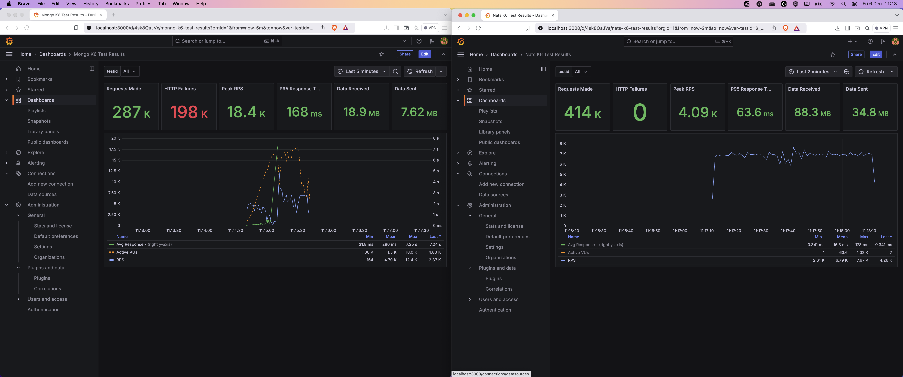

# NATS IO Poc vs Mongo DB

## 📊 **Description**

This repository presents a **Proof of Concept (PoC)** designed to compare the performance of **NATS IO** and **MongoDB** under high traffic conditions. The test simulates a heavy load of **7000 requests per second** for a duration of **1 minute**, measuring both **successful** and **failed** requests.

---

### NATS Winner (Overall) Locally!

#### Performance Metrics (7000 req/sec for 1 minute)

<table border="1">
  <thead>
    <tr>
      <th><strong>System</strong></th>
      <th><strong>Total Requests</strong></th>
      <th><strong>Failed Requests</strong></th>
      <th><strong>Expected Total</strong></th>
      <th><strong>Total OK</strong></th>
    </tr>
  </thead>
  <tbody>
    <tr>
      <td><strong>Mongo (Left)</strong></td>
      <td>287K</td>
      <td>198K</td>
      <td>420K</td>
      <td>89K</td>
    </tr>
    <tr>
      <td><strong>NATS (Right)</strong></td>
      <td>414K</td>
      <td>0</td>
      <td>420K</td>
      <td>414K</td>
    </tr>
  </tbody>
</table>

---

